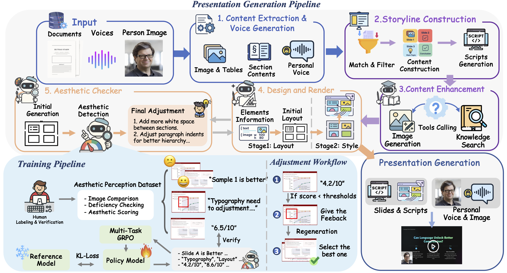
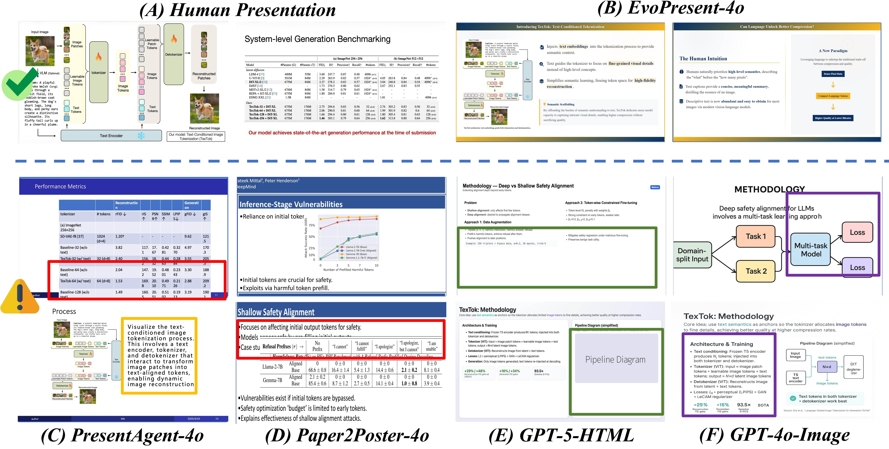

# *Presenting a Paper is an Art*: Self-Improvement Aesthetic Agents for Academic Presentations

<a href='https://arxiv.org/abs/2510.05571'></a> <a href='https://evopresent.github.io/'></a> <a href='https://huggingface.co/datasets/TobyYang7/EvoPresent'></a> <a href='https://huggingface.co/LCZZZZ/PresAesth'></a> <a href='https://evopresent.github.io/'></a> <a href="https://x.com/xwang_lk/status/1975917585175642496" target="_blank"></a>    

 ## 💡 Update
- [X] Official release of our paper and demo！ 🎉
- [X] Training setup has been made available. The aesthetic model weights will be released this week.
- [ ] Launch of the self-improvement aesthetic agent this week.
- [ ] Certain benchmark data has been made available; however, due to potential copyright restrictions, the full benchmark will be released at a later time.

 ## 🔥 Demo

 https://github.com/user-attachments/assets/49cd7ab8-3259-4f45-a9eb-a5f8211b9549

Check out more at [🎨 project web](https://evopresent.github.io/).

## 🛠️ Environment
```bash
pip install -r requirements.txt
```

**API Installation**
Create a `.env` file in the project root and add your OpenAI API key:
```bash
OPENAI_API_KEY=<your_openai_api_key>
```


## 🚀  EvoPresent Agent Pipeline



Overview of the EvoPresent framework. (a) EvoPresent first performs content extraction and voice generation, then constructs the storyline and script, followed by content enhancement using image generation and knowledge retrieval. Design and rendering are handled next, and the aesthetic checker evaluates the initial slide and provides adjustments. (b) PresAesth is trained on a human-preference aesthetic dataset via multiple tasks (scoring, defect adjustment, and comparison). (c) The PresAesth model guides the agent framework in iterative self-improvement.

## 🏋️‍♂️ Training

This section contains the training infrastructure for the **PresAesth** model, which is based on [Qwen2.5-VL-7B-Instruct](https://huggingface.co/Qwen/Qwen2.5-VL-7B-Instruct) and fine-tuned for presentation aesthetics evaluation tasks.

1. **Environment Setup**
   ```bash
   # install uv first
   # pip install uv
   cd train
   bash ./setup.sh
   ```

2. **Configure Environment Variables**
   ```bash
   # Edit .env file with your API keys and configuration (for evaluation and verification)
   cp env-template .env
   ```

3. **Start Training**
   ```bash
   source train_env/bin/activate
   bash ./run.sh
   ```

4. **Evaluation & Inference**
   ```bash
   python eval.py
   python inference.py
   ```

## 📊 EvoPresent Benchmark


## 🎨 Aesthetic Comparison



## Acknowledgement
We appreciate the releasing codes and data of [open-r1-multimodal](https://github.com/EvolvingLMMs-Lab/open-r1-multimodal), [Paper2Poster](https://github.com/Paper2Poster/Paper2Poster/) and [Float](https://github.com/deepbrainai-research/float) .

## Citation

```bibtex
@misc{liu2025presentingpaperartselfimprovement,
      title={Presenting a Paper is an Art: Self-Improvement Aesthetic Agents for Academic Presentations}, 
      author={Chengzhi Liu and Yuzhe Yang and Kaiwen Zhou and Zhen Zhang and Yue Fan and Yannan Xie and Peng Qi and Xin Eric Wang},
      year={2025},
      eprint={2510.05571},
      archivePrefix={arXiv},
      primaryClass={cs.CL},
      url={https://arxiv.org/abs/2510.05571}, 
}
```
